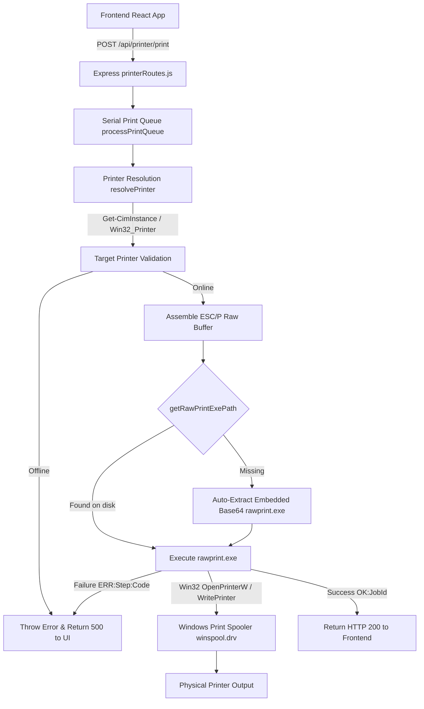

# RBS Printer & Printing System — Technical Documentation

## Executive Overview
The **Restaurant Billing System (RBS)** printer subsystem provides low-latency, serial-queued, raw ESC/P thermal and dot-matrix receipt printing across Windows (Windows 10/11) and macOS. It relies on a native Win32 API bridge (`winspool.drv`), hardware control sequences, automatic fallback mechanisms, and a serial execution queue to guarantee print reliability, optimal density, and maximum speed.

---

## 1. System Architecture Diagram



---

## 2. Environment Configuration & Setup Logic

The printer system is controlled by environment variables configured in `backend/.env`:

| Variable Name | Default | Description |
| :--- | :--- | :--- |
| `PRINTER_NAME` | `""` | Name or substring of target receipt printer (e.g. `Generic / Text Only`, `TVS RP 3150`). If blank, defaults to system default printer. |
| `DISABLE_PRINTER_CHECK` | `false` | When set to `true`, bypasses WMI status checks (useful for dev/testing environments). |
| `PRINTER_FEED_LINES` | `"4"` | Number of line feeds (`\r\n`) sent at receipt footer before cutting/stopping. |
| `PRINTER_MEDIA_SIZE` | `"Custom.8.5x4in"` | Media size override passed to `lp` command on macOS. |

### Printer Name Normalization Algorithm
To prevent failures caused by leading/trailing spaces, hyphens, underscores, or case differences, all printer names are passed through `normalizePrinterName()`:

```javascript
function normalizePrinterName(name) {
  if (!name) return "";
  return name.toLowerCase().replace(/[\s\-_]+/g, "").trim();
}
```

### Resolution Matching Order (`resolvePrinter()`)
When resolving a printer target, the system executes PowerShell WMI/CIM queries and evaluates printers in 4 strict priority tiers:

1. **Exact Match**: Match normalized `PRINTER_NAME` against `Win32_Printer.Name` or `Win32_Printer.ShareName`.
2. **Substring Match**: Fallback match where target name contains or is contained in installed printer names.
3. **System Default**: Select printer where `Win32_Printer.Default -eq $true`.
4. **First Available**: Fallback to first installed printer on the machine.

---

## 3. Printer Status Logic (`/api/printer/status`)

### Windows Status Check Flow
The status check runs a non-interactive PowerShell script that inspects:
- `WorkOffline` property from `Win32_Printer`
- `PrinterStatus` enum (`2` = Error, `7` = Offline)
- `Get-Printer` status string

```javascript
// Response status codes returned by PowerShell sub-process:
ONLINE:<Name>|<ShareName>|<DriverName>|<Shared>   // Exit Code 0 -> HTTP 200
OFFLINE:<Name>|<ShareName>|<DriverName>|<Shared>  // Exit Code 2 -> HTTP 500
NOT_FOUND:<InstalledList>                        // Exit Code 1 -> HTTP 500
```

---

## 4. Native Win32 RAW Printing Architecture (`rawprint.exe` & `RawPrint.cs`)

### Why Native P/Invoke Replaced SMB Shares (`copy /b \\localhost\share`)
- **Old Method**: `copy /b <tempfile> "\\localhost\ShareName"`
- **Why It Failed**: On Windows 10, when the backend runs as an NSSM Windows Service under the `LocalSystem` account, network authentication to `\\localhost` requires machine account network credentials which are blocked by default security policies.

### Native Win32 `winspool.drv` Engine
`RawPrint.cs` is a lightweight (6 KB) C# application compiled to `rawprint.exe`. It bypasses network SMB shares and communicates directly with the Windows Print Spooler API:

```csharp
[DllImport("winspool.drv", EntryPoint = "OpenPrinterW", SetLastError = true, CharSet = CharSet.Unicode)]
public static extern bool OpenPrinter(string pPrinterName, out IntPtr phPrinter, IntPtr pDefault);

[DllImport("winspool.drv", EntryPoint = "StartDocPrinterW", SetLastError = true, CharSet = CharSet.Unicode)]
public static extern int StartDocPrinter(IntPtr hPrinter, int level, ref DOC_INFO_1 pDocInfo);

[DllImport("winspool.drv", EntryPoint = "WritePrinter", SetLastError = true)]
public static extern bool WritePrinter(IntPtr hPrinter, byte[] pBuf, int cbBuf, out int pcWritten);
```

#### Output Protocol of `rawprint.exe`:
- **Success**: `OK:<SpoolerJobId>` (Exit Code `0`)
- **Failure**: `ERR:<Step>:<Win32ErrorCode>:<Win32ErrorMessage>` (Exit Code `1`)

### Auto-Healing Base64 Fallback
To ensure 100% execution reliability even if `rawprint.exe` is deleted or missing from the deployment directory, `printerRoutes.js` embeds a compiled Base64 binary of `rawprint.exe`. If `getRawPrintExePath()` finds no file on disk, it auto-extracts the embedded binary to disk before launching `execFile`.

---

## 5. ESC/P Hardware Control Sequences & Print Quality Tuning

Receipt text is wrapped in standard ESC/P control sequences before sending to the spooler:

```javascript
const ESC = 0x1B;
const escPrefix = Buffer.from([
  0x0D,                     // CR     — Flush partial line buffer
  ESC, 0x40,                // ESC @  — Initialize printer
  ESC, 0x78, 0x00,          // ESC x 0 — Draft mode (Maximum speed)
  ESC, 0x45,                // ESC E  — Emphasized mode ON (DARK, sharp text)
  ESC, 0x55, 0x01,          // ESC U 1 — Unidirectional mode ON (Fixes dark/light alternate lines)
  ESC, 0x4D,                // ESC M  — 12 CPI (Elite pitch)
  ESC, 0x32,                // ESC 2  — 1/6-inch line spacing
  ESC, 0x6C, 0x00,          // ESC l 0 — Left margin = 0
]);
```

### Quality & Speed Problem Fixes:
1. **Alternating Dark and Light Lines Fix (`ESC U 1`)**:
   - In bidirectional printing mode (`ESC U 0`), printhead alignment or voltage variance causes odd lines to print dark and even lines to print light.
   - Setting **Unidirectional Printing ON** (`ESC U 1`) forces the head to print left-to-right on every pass, eliminating density variations and making all lines 100% uniform.
2. **Dark Content at Maximum Speed (`ESC E` + `ESC x 0`)**:
   - **`ESC E` (Emphasized Mode)** fires dot pins with wider micro-pulses in a single pass, producing dark, bold characters with **zero speed penalty**.
   - Differs from `ESC G` (Double-strike mode), which cuts print speed in half by making two physical passes per line.

---

## 6. Serial Queue & Concurrency Management

To prevent buffer overlap when multiple billing screens print simultaneously:

1. **Queue Structure**: `printQueue` holds pending `{ printBuf, jobId, resolve, reject }` items.
2. **Execution Lock**: `printQueueRunning` flag ensures only 1 print job executes against `winspool.drv` at any time.
3. **Retry Mechanism**: Automatically retries a failed print job once after a 400ms delay.
4. **Execution Timeout**: Enforces a strict 25-second limit (`EXEC_TIMEOUT = 25000`) via `Promise.race`.

---

## 7. Express API Endpoints

### `GET /api/printer/status`
Checks if the target printer is online and ready.
- **Response**: `{ connected: true, printer: "TVS RP 3150", driverName: "Generic / Text Only", shared: false }`

### `GET /api/printer/list`
Lists all installed system printers with online and default status indicators.
- **Response**: `{ printers: [ { name: "...", shared: false, default: true, online: true } ] }`

### `POST /api/printer/config`
Updates target printer configuration and writes `PRINTER_NAME` to `.env`.
- **Request Body**: `{ "printerName": "TVS RP 3150" }`

### `POST /api/printer/print`
Queues receipt payload for printing.
- **Request Body**: `{ "text": "Receipt Text Content..." }`
- **Response**: `{ success: true, jobId: "uuid", printer: "TVS RP 3150", spoolerJobId: 104 }`

---

## 8. Build & Distribution Integration

The build scripts ensure `rawprint.exe` is compiled and packaged in every release artifact:

- **[build-package.ps1](file:///c:/Users/deept/OneDrive/Desktop/Deepthi-pp/rbs/restaurant-billing-app/deploy/build-package.ps1)**: Compiles `RawPrint.cs` with `csc.exe` and outputs to `dist-package/backend/rawprint.exe` and `rbs-deploy-package.zip`.
- **[build-apps-only.ps1](file:///c:/Users/deept/OneDrive/Desktop/Deepthi-pp/rbs/restaurant-billing-app/deploy/build-apps-only.ps1)**: Packages `rawprint.exe` alongside `rbs-backend.exe` in `apps-only-package/backend/` and `rbs-apps-only.zip`.
- **[package.json](file:///c:/Users/deept/OneDrive/Desktop/Deepthi-pp/rbs/restaurant-billing-app/backend/package.json)**: `npm run build:exe` automatically triggers `npm run build:csc` prior to `pkg`.

---

## 9. Key System File References
- Backend Printer Router: [printerRoutes.js](file:///c:/Users/deept/OneDrive/Desktop/Deepthi-pp/rbs/restaurant-billing-app/backend/src/routes/printerRoutes.js)
- Native Win32 C# Source: [RawPrint.cs](file:///c:/Users/deept/OneDrive/Desktop/Deepthi-pp/rbs/restaurant-billing-app/backend/RawPrint.cs)
- Manual Spooler Test Script: [test-raw-print.js](file:///c:/Users/deept/OneDrive/Desktop/Deepthi-pp/rbs/restaurant-billing-app/backend/tests/test-raw-print.js)
- Full Build Script: [build-package.ps1](file:///c:/Users/deept/OneDrive/Desktop/Deepthi-pp/rbs/restaurant-billing-app/deploy/build-package.ps1)
